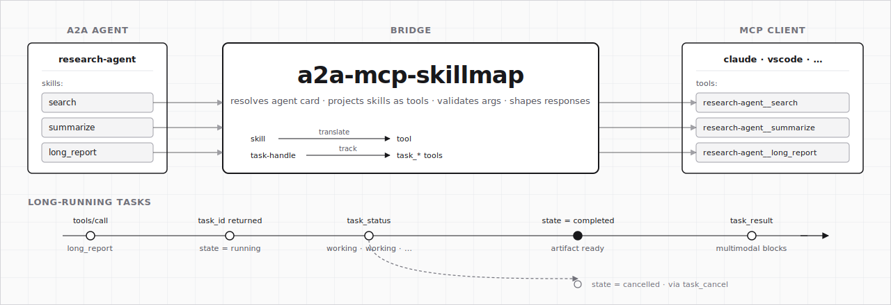

<p align="center">
  <picture>
    <source media="(prefers-color-scheme: dark)" srcset="docs/assets/banner-dark.svg">
    <source media="(prefers-color-scheme: light)" srcset="docs/assets/banner-light.svg">
    
  </picture>
</p>

# a2a-mcp-skillmap

[](https://github.com/shashikanth-gs/a2a-mcp-skillmap/actions/workflows/ci.yml)
[](https://www.npmjs.com/package/a2a-mcp-skillmap)
[](https://nodejs.org)
[](LICENSE)

**Turn any A2A agent into a first-class MCP tool server — with zero glue code.**

Point it at one or more [A2A](https://a2aproject.org) agent URLs and it resolves their skill cards, projects every skill as an [MCP](https://modelcontextprotocol.io) tool, and serves the result over stdio or HTTP. Your MCP client sees ordinary tools; the bridge handles everything behind the scenes — validation, task lifecycle, auth, response shaping.

```bash
npx a2a-mcp-skillmap --a2a-url https://agent.example.com
```

That's it. No schemas to hand-map, no wrappers to write, no protocol translation to maintain.

---

## Why this bridge

**One MCP tool per skill — not one tool per agent.** The naive way to bridge A2A to MCP is to expose each agent as a single catch-all tool and let the LLM figure out which skill to invoke via free-form arguments. That wastes context on protocol plumbing and makes tool choice fuzzy. This bridge parses each agent's skill card and projects **every skill as its own first-class MCP tool** — `research-agent__search`, `research-agent__summarize`, `compliance-agent__check_policy`. Each carries the skill's own description and input schema, so the LLM sees distinct, typed tools and picks the right one the same way it picks any other function call.

**Token-optimized responses.** The default `artifact` response mode strips the A2A protocol envelope (message IDs, context IDs, task metadata) and emits only the content the model actually needs — native MCP blocks for text, image, audio, and file parts. No `"kind":"message","role":"agent",...` boilerplate in every response; no re-parsing a stringified JSON blob. When you do need the metadata for programmatic consumers, opt into `structured` or `raw` mode. Every token you save is a token the LLM can spend on reasoning.

**Sync-fast, async-safe by the same tool call.** A2A agents can reply immediately or kick off a long-running task. The bridge picks the right shape automatically: replies within the configured **sync budget** (default 30s, configurable per deployment) come back in-line as a normal tool result; anything slower returns a `taskId` and surfaces three built-in tools — `task_status`, `task_result`, `task_cancel` — that the client polls with that ID. No protocol mental model for your client to learn, no streaming wiring to maintain, and no tool call that silently hangs.

**Dynamic, not declarative.** Agents evolve. When a skill is added, renamed, or has its schema tightened on the A2A side, the bridge picks it up on the next refresh — no PR to this project, no redeployment of a hand-written adapter.

**Correctness is measured, not asserted.** The design document defines **17 correctness properties** — tool-name determinism, input-validation gate, task state monotonicity, response-projector schema validity, credential redaction, config round-trip, and more. Every one is verified by a `fast-check` property test with ≥ 100 randomized iterations. CI gates on branch coverage ≥ 80% and statement coverage ≥ 85%.

**Deterministic by design.** Same agent card in → same MCP tools out. Same invocation args → same projected response. Tool names are a pure function of `(agentId, skillId)`, so your MCP client's tool-reference cache stays valid across restarts and across deployments. A name-derivation change is a **major version bump** — stated in the changelog.

**Security as a property, not an afterthought.** Credentials are accepted only via env vars or config files (never CLI flags, which leak to shell history and `ps`). Every log path runs tokens through pino's redaction — the fixed sentinel is `[REDACTED]` and a property test asserts nothing else can slip through. Inbound auth uses constant-time comparison. Input validation happens _before_ any outbound call, so malformed arguments never reach the remote agent.

**Pluggable where it matters.** The response projector, tool-naming strategy, inbound/outbound auth providers, and storage backends are all interfaces with sensible defaults. Swap any one without forking. Want Redis-backed task persistence instead of in-memory? Implement `TaskStore` and pass it to `createBridge()`.

**SDK-first.** Built on the official `@modelcontextprotocol/sdk` and `@a2a-js/sdk` — no hand-rolled JSON-RPC framing, no reinvented transport. Upstream protocol improvements land here automatically.

---

## What you get out of the box

- **Two transports**, same engine: stdio for local MCP clients, Streamable HTTP for networked deployments.
- **Four response modes** — `artifact` (default, multimodal), `structured` (full canonical + metadata), `compact` (≤ 280-char summary), `raw` (byte-equivalent A2A payload). Switch per-deployment. Side-by-side JSON examples in the [operator guide](docs/operator-guide.md#response-modes).
- **Bearer + API-key auth on both sides** — inbound for HTTP clients calling the bridge, outbound per-agent. Credentials never reach CLI flags or logs.
- **Structured JSON logs** (pino) with automatic correlation IDs tying every log line, every telemetry event, and every OpenTelemetry span to a single tool invocation.
- **OpenTelemetry**, optional: `setOtelTracer(tracer)` and you get spans around every invocation and agent resolution. Zero runtime cost when unused.
- **Graceful degradation.** One broken agent card never takes down the others. One unsupported skill schema never kills its siblings. Agent refreshes are atomic — the old card keeps serving until the new one validates.

---

## Quickstart

Three ways to run the bridge, in order of effort.

### 1. One agent, stdio, no config file

The simplest setup. Point it at a single A2A agent and let it listen on stdin/stdout — that's what an MCP client (Claude Desktop, VS Code, Inspector) expects when it launches the bridge as a child process.

```bash
npx a2a-mcp-skillmap --a2a-url https://agent.example.com
```

Every skill the agent advertises now shows up as a tool in your MCP client.

### 2. Multiple agents over HTTP, with a config file

When you have more than one agent, need per-agent credentials, or want to serve MCP over the network instead of stdin — use a config file. Save the following as `bridge.json` (anywhere you like — the path is passed on the command line):

```json
{
  "agents": [
    { "url": "https://research-agent.example.com" },
    {
      "url": "https://compliance-agent.example.com",
      "auth": { "mode": "bearer", "token": "..." }
    }
  ],
  "transport": "http",
  "http": {
    "port": 3000,
    "inboundAuth": { "mode": "bearer", "token": "my-mcp-secret" }
  },
  "responseMode": "artifact"
}
```

Then start the bridge against that file:

```bash
npx a2a-mcp-skillmap --config ./bridge.json
```

The bridge loads both agents (each with its own outbound credential), exposes a single HTTP endpoint at `http://localhost:3000/mcp`, and requires MCP clients to authenticate with the `my-mcp-secret` bearer token on the way in.

### 3. Embed in your own Node app (programmatic SDK)

```ts
import { createBridge, DefaultA2ADispatcher, loadConfig } from 'a2a-mcp-skillmap';

const config = loadConfig({ filePath: './bridge.json' });
const bridge = createBridge(config, {
  dispatcher: new DefaultA2ADispatcher(),
  // swap any default here — projector, naming, stores, auth providers
});

await bridge.start();
// ... bridge.engine.listTools(), bridge.engine.callTool(name, args)
await bridge.stop();
```

---

## How it works

```
┌──────────────┐     MCP (stdio / HTTP)    ┌─────────────────────────┐     A2A (JSON-RPC)     ┌──────────────┐
│  MCP Client  │ ◀───────────────────────▶ │   a2a-mcp-skillmap      │ ◀────────────────────▶ │  A2A Agent   │
└──────────────┘                           │ ┌─────────────────────┐ │                        └──────────────┘
                                           │ │ AgentRegistry       │ │
                                           │ │ ToolGenerator       │ │     ↻ resolves & refreshes agent cards
                                           │ │ InvocationRuntime   │ │     ↻ validates args (Zod) pre-dispatch
                                           │ │ TaskManager         │ │     ↻ tracks long-running jobs
                                           │ │ ResponseProjector   │ │     ↻ shapes result per mode
                                           │ └─────────────────────┘ │
                                           └─────────────────────────┘
```

All external data — agent cards, skill schemas, MCP tool calls — is validated at ingress and normalized into a canonical internal model before any logic runs. That boundary is why behavior stays deterministic: the engine never sees raw wire data.

---

## Documentation

- **[Examples](examples/)** — every supported way to start the bridge (CLI, env, config file, programmatic, embedded in MCP clients), with copy-pasteable snippets.
- **[API reference](docs/api-reference.md)** — every exported symbol, its parameters, return types, and error conditions.
- **[CLI reference](docs/cli-reference.md)** — every flag, env var, config key, and exit code.
- **[Operator guide](docs/operator-guide.md)** — transport selection, authentication, response modes, observability, reference performance.
- **[Contributor guide](docs/contributor-guide.md)** — dev setup, commit conventions, review process, release process.
- **[Security](docs/security.md)** — threat model, secret handling, vulnerability reporting.
- **[ADRs](docs/adr/)** — architectural decision records.
- **[Traceability matrix](docs/traceability-matrix.md)** — every requirement mapped to design, code, and tests.

---

## Requirements

- Node.js `>=20`
- ESM (`"type": "module"`)
- Peer dep `@opentelemetry/api` is optional — only needed if you wire a tracer

---

## Contributing

Issues and PRs welcome. See the [contributor guide](docs/contributor-guide.md) for setup and conventions. Security issues go through [GitHub Security Advisories](../../security/advisories/new) — please don't open public issues for suspected vulnerabilities.

## License

[MIT](LICENSE)
